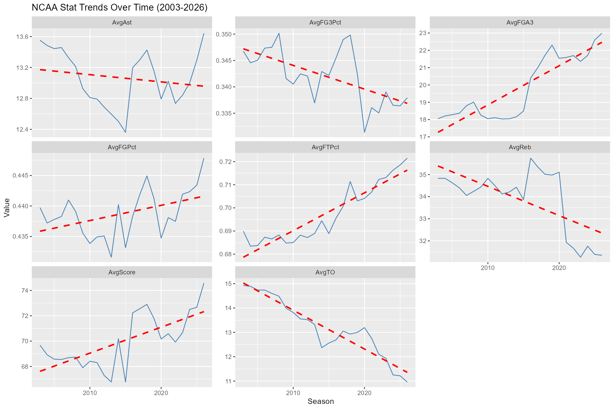
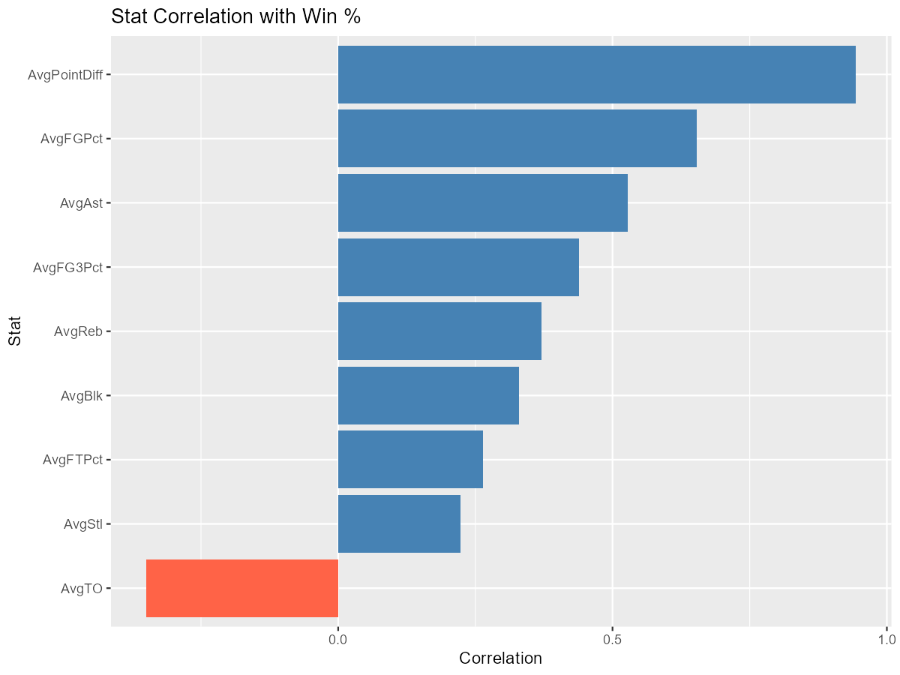
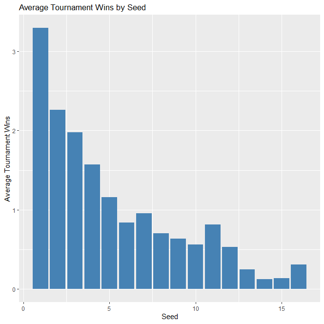
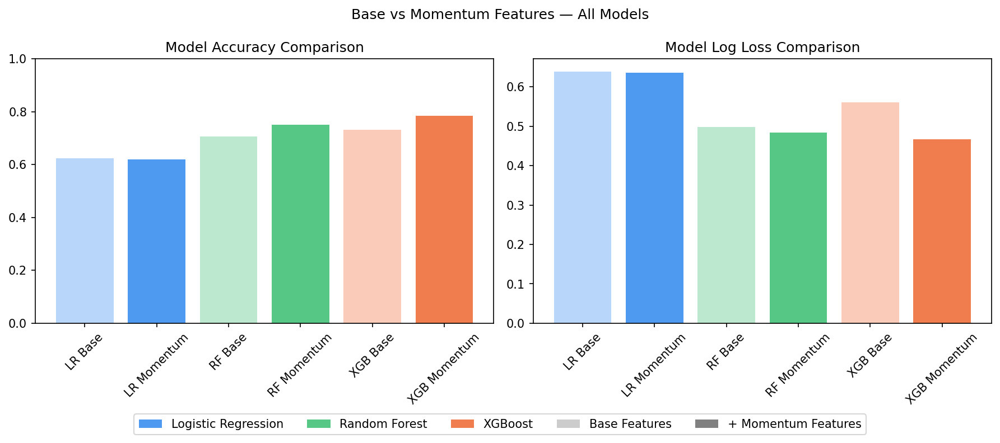
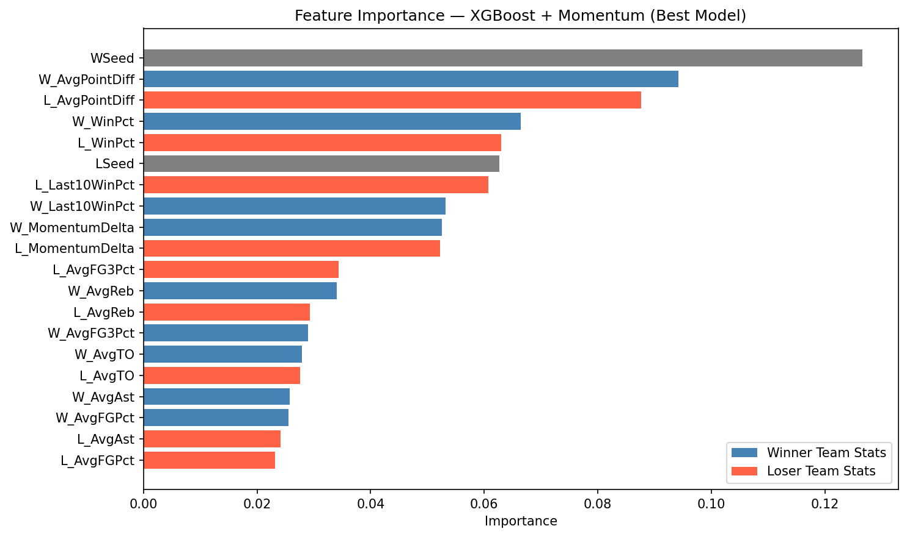
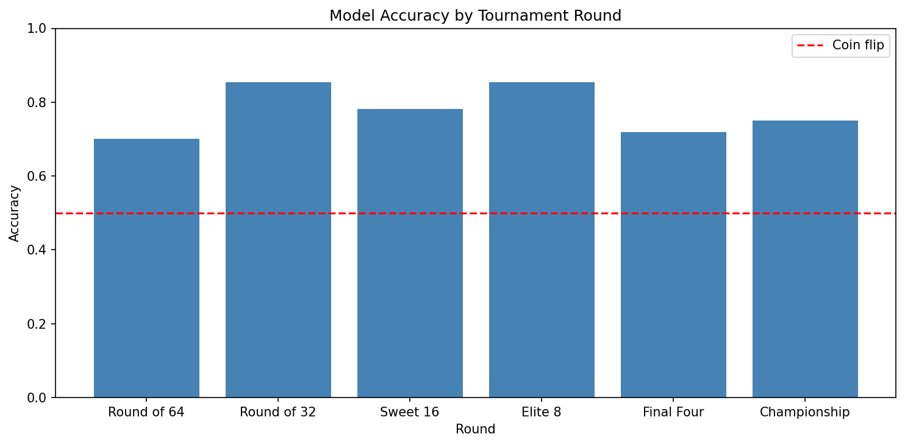

# Introduction
March Madness is one of the most unpredictable sporting events in the world, where a single-elimination tournament of 68 teams produces upsets, Cinderella stories, and bracket-busting moments every year. Despite this unpredictability, patterns exist in the data — teams that shoot efficiently, protect the ball, and enter the tournament with momentum tend to outperform expectations.

This project analyses historical NCAA Division I men's basketball data from the Kaggle March Machine Learning Mania 2026 competition to explore three core analytics questions:


**Question 1:**
  How have team performance metrics evolved over time, and which stats correlate most with winning?
  
**Question 2:**
 Does late-season momentum predict deeper tournament runs, and can hot teams outperform their seed expectation?
    
**Question 3:**
  Can tournament game outcomes be accurately predicted using regular season statistics, and how do different models compare?
  
All document and code available on github: https://github.com/Nicholas-lkn/March-Machine-Learning-Mania-2026-March-Madness-Analytics

# Data
The dataset contains game-level results for NCAA Div I men's basketball from 1985 to 2026, from the Kaggle March Machine Learning Mania 2026 competition. Box score statistics are available from 2003 onward. Four files were used: regular season detailed results, tournament detailed results, tournament seeds, and team ID mappings.

Data was cleaned and processed in R. Raw and cleaned versions are kept separate. The cleaned data was loaded into a local SQLite database and mirrored in Google BigQuery for cloud storage.

## Data Dictionary
```{r data-dictionary, echo=FALSE, message=FALSE, warning=FALSE}
library(readr)
library(dplyr)
library(knitr)
library(kableExtra)

data_dict <- read_csv("../data/cleaned/data_dictionary.csv")

kable(data_dict, caption = "Data Dictionary", booktabs = TRUE, longtable = TRUE) %>%
  kable_styling(
    latex_options = c("hold_position", "striped", "scale_down"),
    font_size = 8,
    full_width = FALSE,
    position = "center"
  ) %>%
  column_spec(3, width = "6cm") %>%  # Description column
  column_spec(4, width = "4cm")      # Source column
```

# Exploratory Data Analysis

## Question 1: How Have Stats Evolved Over Time?

NCAA basketball has shifted significantly over the past two decades. The faceted chart below shows how key team metrics have trended from 2003 to 2026.

```{r stat-trends, echo=FALSE, fig.align='center', out.width='70%'}

```

NCAA team statistics show a clear evolution toward a more modern, perimeter focused of play. Turnovers have declined sharply, reflecting improved ball handling in the modern game. Scoring and overall field goal efficiency have risen steadily, consistent with the "pace and space" era. Three-point attempt volume has increased while three-point percentage has declined slightly, likely because of this higher volume and an insistence on outside shooting. Overall, these trends illustrate a shift towards a faster paced game, with emphasises on efficience and perimeter offense. 

The chart below shows which stats correlate most strongly with winning percentage.

```{r correlation-plot, echo=FALSE, fig.align='center', out.width='70%'}

```

Point differential is the best predictor of win percentage, followed by field goal percentage and assists. Three-point percentage and rebounds show moderate positive correlation, while turnovers show a strong negative correlation as expected.

## Question 2: Does Momentum Predict Tournament Success?

A momentum metric was defined as a team's win percentage in their last 10 regular season games. A momentum delta was computed as the difference between this recent win rate and their overall season win rate, positive values indicate a team got hot going into the tournament, negative values indicate cooling off.

```{r momentum-performance, echo=FALSE, fig.align='center', out.width='70%'}
knitr::include_graphics(c("../reports/MomentumLinear.png", "../reports/MomentumLoess.png"))
```

The LOESS fit reveals an S-curve relationship, momentum has the most impact for teams in the middle range of the delta and extreme cases flatten out. Teams that got hot going into the tournament tended to outperform their seed expectation, though the relationship has high variance consistent with the  unpredictability of March Madness. This finding motivated the inclusion of momentum features in the predictive models.

## Question 3: Seed vs Tournament Performance
Before modeling, seeding was examined as a baseline predictor of tournament success. Average tournament wins decrease from seed 1 to seed 16 as expected, though the relationship is not perfectly linear. Motivating the use of other kinds of models.
```{r tournament-wins-seed, echo=FALSE, fig.align='center', out.width='70%'}

```

# Predictive Modeling

## Feature Engineering
Each tournament game was represented as a matchup between two teams. Features included both teams' season averages for win rate, point differential, FG%, 3P%, rebounds, assists, and turnovers, as well as tournament seeds and momentum features. A flipped version of each matchup was added with the label reversed to create a balanced dataset. The dataset was split between pre-2022 seasons for training and 2022  for testing. Recent seasons were weighted more heavily during training to reflect the modern style of play.

## Model Results
Three models were trained: logistic regression, random forest, and XGBoost. Each was trained twice, once with base features and once with momentum features *(Last10Games and Last10-SeasonWinRate)* added.

```{r model-performance, echo=FALSE, fig.align='center', out.width='70%'}


kable(
  data.frame(
    Model = c("Logistic Regression", "Logistic Regression", "Random Forest", "Random Forest", "XGBoost", "XGBoost"),
    Features = c("Base", " +Momentum", "Base", " +Momentum", "Base", "+Momentum"),
    Accuracy = c("62.3%", "61.9%", "70.7%", "75.2%", "73.1%", "78.5%"),
    LogLoss = c(0.639, 0.636, 0.498, 0.484, 0.561, 0.466)
  ), 
  align = c('l', 'c', 'r', 'r')
)
```

The best performing model was XGBoost with momentum added, with 78.5% accuracy. Adding momentum features improved both tree-based models but not logistic regression. This suggesting momentum has a non-linear relationship with tournament outcomes that logistic regression is unable capture.

## Feature

```{r feature-importance, echo=FALSE, fig.align='center', out.width='70%'}

```
Most important features based on the best performing model *XGBoost* including a teams seed, average point differential for both teams in the matchup, followed by win percentage for both teams, and seed for the opposing team. Followed by the momentum statistics created for this project before a stark dropoff to other statistics.

## Model accuracy By Tournament Round

```{r accuracy-byRound, echo=FALSE, fig.align='center', out.width='70%'}

```

# Conclusions

**Key Findings:**

- NCAA basketball has shifted toward higher scoring, better shooting efficiency, and significantly fewer turnovers over the past two decades
- Point differential and field goal percentage are the strongest regular season predictors of winning
- Momentum has a real but noisy relationship with tournament success, teams that get hot going in tend to outperform their seed, but the effect is not guaranteed
- XGBoost with momentum features achieved 78.5% accuracy on tournament games, meaningfully outperforming seed alone as a predictor
- Adding momentum features improved tree-based models but not logistic regression, confirming the non-linear nature of momentum's effect

**Limitations:**

- Detailed statistics go back to 2003, limiting historical trend analysis

- The momentum metric uses only the last 10 games, strength of schedule during that stretch is not accounted for

- Models may still favor historically dominant programs despite recent season weighting

- Tournament samples per season are small (63 games), making test sets limited

**Next Steps:**

- Hyperparameter tuning to further improve model performance
- Incorporate strength of schedule and conference adjustment into features
- Extend analysis to women's tournament data for comparison
- Explore ensemble methods combining all three models

# Ethics and Risks

The dataset is publicly available through Kaggle under their competition terms and contains no personal data. Models trained on historical data may favor historically dominant programs, this was partially mitigated by weighting recent seasons more heavily during training. All data sources cited.


# Reproducibility

To reproduce this analysis:

1. Download the dataset from https://www.kaggle.com/competitions/march-machine-learning-mania-2026/data
2. Place all CSVs into `data/raw/`
3. Run R scripts in order of: `explore.R`, `cleaned.R`, `eda.R`, `sqlite.R`
4. Run `notebooks/modelling.ipynb` for predictive modeling
5. Knit `r/ReportPdf.Rmd` to generate the PDF report

# References

- Kaggle March Machine Learning Mania 2026: https://www.kaggle.com/competitions/march-machine-learning-mania-2026
- R tidyverse: Wickham et al. (2019)
- scikit-learn: Pedregosa et al. (2011)
- XGBoost: Chen & Guestrin (2016)

